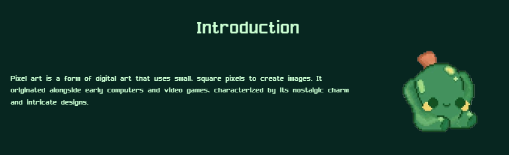
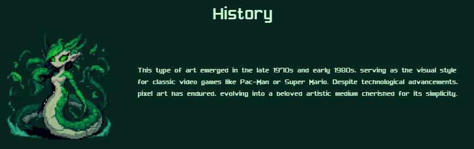
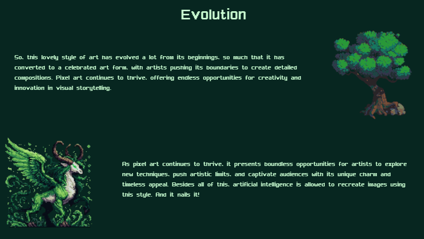
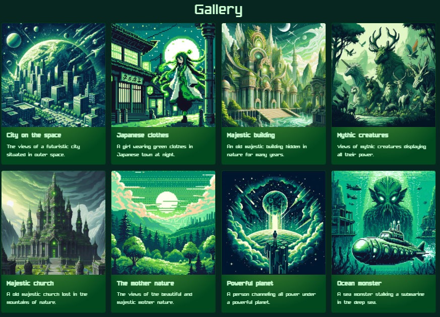
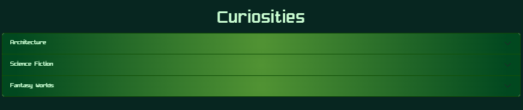
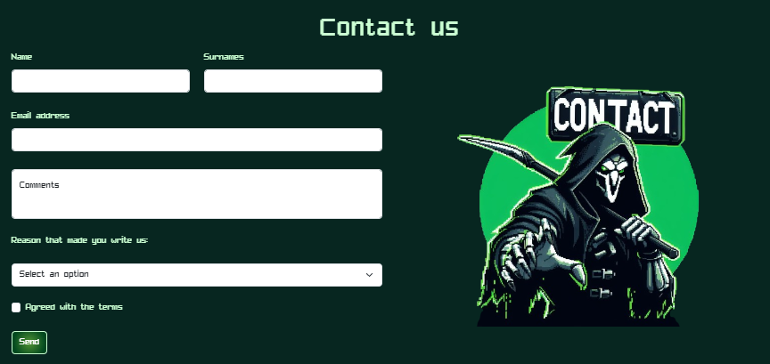

# 🖌 Exploring the Pixel Art's Website 🖌

## Motivation for Creating this Web ✨

I have decided to make this website about Pixel Art because recently I have seen some videos about it and I thought: Why not? Obviously I chose a green color palette but I could have chosen a very different one. Just wanted to use one color

## Welcome to the Pixel Art World! 🌍

### What is Pixel Art? 🧶

Pixel art effortlessly transports enthusiasts back to the nostalgic era of 8 and 16-bit gaming. As a creative medium, it sparks imagination and serves as a gateway to a vibrant world of pixelated wonders on our website.

### Structure - Featured Content - The website is made up of these sections 📋

- ➰ **An animated Hero Section**
- 🗳 **Introduction** Learn about how Pixel Art arrived to our lives and what is it like 
   
- 🚂 **Pixel Art History:** Explore ingenious artists creations that have driven this retro-style world of drawing. 
   
- 🧭 **Evolution:** Discover how this style has evolved along the years and how it is still working till our days 
   
- 📸 **Gallery:** Explore this beautiful art with a Gallery made with Bootstrap's Cards. You will love it 
   
- 😶‍🌫️ **Curiosities** Where you will find more details about themes that people loves drawing in Pixel Art 
   
- 📫 **Contact** Here, you can find us in our custom Contact section. Hoping to see you sending an email! 
   
- 🦶 **Footer:** With the favicon, my name and more things 

Thank you for exploring this fascinating retro-painting style, and hope that I can see you on my website!

## Web page style 🖊️

### Fonts 🪧

This page have used 2 fonts for text (both from 1001fonts):
- Nihonium113
- Pixelfont7

### Color palette 🌈

60% Dark Green , 30% Green and 10% Light Green

### Images 📷

Taken from the internet to match the color palette. The specific credits of the taken ones are here:  
<b>Nav Bar at the right:</b> Slime by dog_lover on dinopixel 
<b>Hero Section GIF:</b> Forever by minimoss on DeviantArt 
<b>Introduction image:</b> Cactus by pixelartmaker.com on Pinterest 
<b>First evolution image:</b> Tree by @RoyalePoe on X (Twitter) 
<b>Body pattern:</b> From es.patter.monster 
The other images are totally generated with AI <b>(DALL-E 3)</b>

<!-- ### Videos 🎞️

Two beautiful Pixel Art videos from Youtube -->

### Code Snippets 👨‍💻

Here is the only Code Snippet used from <b>uiverse.io</b>: 

<b>Hero button: </b>Made by VashonG from uiverse.io

 
Now, mention the Code Snippets used from <b>Bootstrap</b>:

<b>Navigation Bar (with custom components)</b>

<b>Cards from Gallery</b>

<b>Accordion from Curiosities</b>

<b>Modal from Terms and Conditions on Contact</b>
 

*This website only has educational and practising purposes and does not seek to profit from it. Developed by David Solera Romero for the subject Lenguaje de Marcas in 1º DAM All rights reserved for the respective authors of the images and animations If I have not mentioned an author, please contact me via Social Network*
